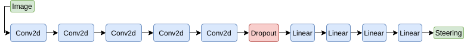
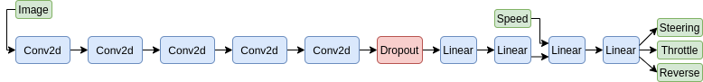
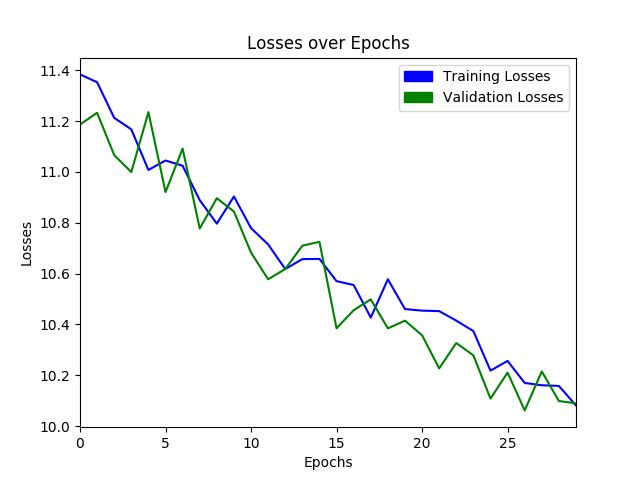

# TorchDrive

This repository aims to implement [NVIDIA's Behavioral Cloning Paper](https://images.nvidia.com/content/tegra/automotive/images/2016/solutions/pdf/end-to-end-dl-using-px.pdf) using PyTorch. However, instead of only generating steering commands to be able to also control the throttle, some modifications are made to the model. While the NVIDIA model is like;

 

And the throttle was controlled by;

    ...
    throttle  =  1.0  -  steering_angle**2  - (speed/speed_limit)**2
    ...

The model I've modified is like;

Thus, It is possible to complete both of the tracks provided in the simulator fully relying on our neural network.

As the source of the data and inference environment, [Udacity Self Driving Car Simulator](https://github.com/udacity/self-driving-car-sim) is utilized since it seamlessly lets gathering the type of data we need. Term 1 Version 2 is used for development of this repository, so it is recommended. 

#### Data Collection
A pretrained model is also available as `driver_best.pt` if you want to skip right to driving.

 1. Launch the simulator and proceed to "Training Mode".
 2. Hit "R" key to chose the directory which the data is going to be saved to. After chosing the directory hit "R" key again to start data recoring. It is recommended to drive minimum 10 mins.
 3. When you're done with your data collection step hit "R" key again. And wait for data capture to end.
 
 Above steps going to create a csv file and a folder full of "dashcam" images. 
!! To be able to drive in both tracks, foreseeably, data should be collected from both.

#### Training

Run training script as below;  

    python3 Train.py -d <path_to_data_csv>
				     -t <training_set_fraction>
				     -e <epochs>
				     -b <batch_size>
				     -l <learning_rate>
				     -m <path_to_model>

To continue to train a previously saved model `-m <path_to_model>` can be used. If not used, a new model will be initialized and trained from scratch. 
 
 Throughout your training, validation will also be performed and the model with the best validation loss will be saved as "driver_best.pt". At the end of the training a graph that shows your training and validation loss will be saved to project directory.
 
  
 
 ###### Your initial losses and progression of training may be different. 
#### Drive !

As you finished your training, you now can see your model drive.

 1. Launch the simulator in "Autonomous Mode".
 2. Then run `python3 drive_torch <path_to_model>`

###### This repo is created by referring this [work](https://github.com/naokishibuya/car-behavioral-cloning).

